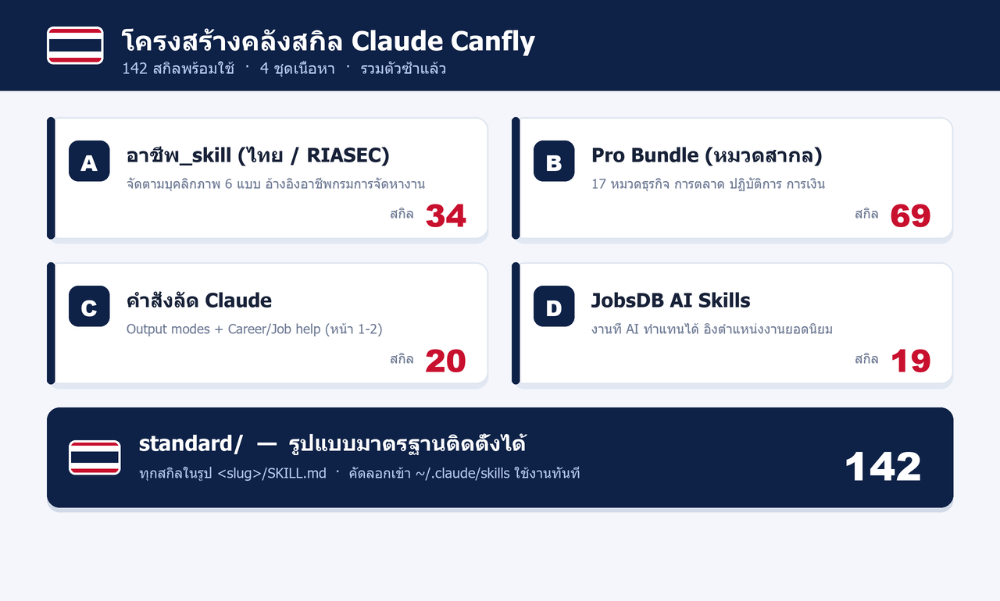

<p align="center">
  
</p>

<h1 align="center">Claude Canfly Skills</h1>

<p align="center">
  คลังสกิล (Skills) สำหรับ Claude และ Claude Code — รวม <b>142 สกิลพร้อมใช้งาน</b><br>
  จัดเป็นโครงสร้างมาตรฐาน ติดตั้งเป็น <code>/slash command</code> ได้ทันที
</p>

---

## คลังนี้คืออะไร

ชุดสกิลภาษาไทยและอังกฤษสำหรับงานธุรกิจ การตลาด การเขียน งานอาชีพ และการทำงานร่วมกับ AI
ทุกสกิลคือ "สูตรการทำงาน" หนึ่งเรื่อง เขียนเป็นไฟล์ Markdown ที่มีโครงชัดเจน — บอกว่าใช้ตอนไหน ทำตามขั้นตอนใด และให้ผลลัพธ์แบบไหน

นำไปใช้ได้สองทาง:
1. เปิดอ่านเป็นเทมเพลต/แนวทางทำงาน แล้วนำเนื้อหาไปใช้กับ Claude
2. ติดตั้งในโฟลเดอร์ `~/.claude/skills/` เพื่อเรียกเป็นคำสั่ง `/slash` ใน Claude Code

---

## โครงสร้างคลังสกิล

<p align="center">
  
</p>

| ชุด | โฟลเดอร์ | เนื้อหา | จำนวน |
|-----|----------|---------|-------|
| A | (ราก) | อาชีพ_skill ภาษาไทย จัดตามบุคลิกภาพ 6 แบบ (RIASEC) อ้างอิงอาชีพจากกรมการจัดหางาน | 34 |
| B | `pro-bundle/` | Pro Bundle 17 หมวดสากล: คอนเทนต์ การตลาด การขาย การเงิน กฎหมาย ปฏิบัติการ ฯลฯ | 69 |
| C | `commands/` | คำสั่งลัด Claude — Output modes + Career/Job help | 20 |
| D | `jobsdb-ai-skills/` | งานที่ AI ทำแทนได้ อิงตำแหน่งงานยอดนิยมบน JobsDB พร้อมระบุส่วนที่ยังต้องใช้คน | 19 |
| — | `standard/` | สกิลทั้งหมดในรูปแบบมาตรฐาน `<slug>/SKILL.md` พร้อมติดตั้ง | 142 |

---

## การรวมตัวซ้ำ (Dedupe)

งานที่ซ้ำกันข้ามชุด 7 กลุ่ม ถูกรวมเหลือ "ตัวที่ดีที่สุด 1 อัน" ส่วนไฟล์ที่ซ้ำแปลงเป็นตัวชี้ทาง (pointer)
ทำให้โฟลเดอร์ `standard/` มีเฉพาะเนื้อหาจริง 142 สกิล ไม่มีตัวซ้ำและไม่มี slug ชนกัน

ตัวอย่างที่รวม: สรุปประชุม, เขียน JD, ตอบอีเมล, ร่างสัญญา, เขียนบล็อก, ผลิต Ad copy, วิเคราะห์สต็อก

---

## ติดตั้งใช้งาน

ติดตั้งทั้งหมดเข้า Claude Code:

```bash
cp -r standard/* ~/.claude/skills/
```

หรือเลือกเฉพาะสกิลที่ต้องการ:

```bash
cp -r standard/blog-post ~/.claude/skills/
```

บน Windows (PowerShell):

```powershell
Copy-Item "standard\blog-post" "$env:USERPROFILE\.claude\skills\" -Recurse -Force
```

จากนั้นเรียกใช้ในแชตด้วย `/blog-post` หรือพิมพ์งานที่ตรงกับ trigger ของสกิลนั้น

> หมายเหตุ: หากติดตั้งจำนวนมากพร้อมกัน สกิลบางตัวที่มี trigger กว้างอาจทำงานบ่อย แนะนำติดตั้งเฉพาะที่ใช้จริงก่อน

---

## โครงสร้างโฟลเดอร์

```
claude-canfly-skill/
  assets/                 กราฟิกประกอบ
  pro-bundle/             ชุด B (17 หมวด)
  commands/               ชุด C (คำสั่งลัด)
  jobsdb-ai-skills/       ชุด D (งานที่ AI ทำแทนได้)
  standard/               142 สกิล รูปแบบมาตรฐาน <slug>/SKILL.md
  *.md (ที่ราก)           ชุด A (อาชีพ_skill ภาษาไทย)
  _make_*.py              สคริปต์สร้าง/รวมไฟล์ใหม่ได้
```

---

## สร้างใหม่ / ปรับแก้

ทุกชุดสร้างจากสคริปต์ Python (ต้องมี Pillow สำหรับกราฟิก):

```bash
python _make_pro_bundle.py        # สร้างชุด B
python _make_commands.py          # สร้างชุด C
python _make_jobsdb_ai_skills.py  # สร้างชุด D
python _make_standard.py          # รวมทุกชุดเป็นรูปแบบมาตรฐาน
python _make_graphics.py          # สร้างกราฟิก banner/structure
```

---

## โครงไฟล์สกิล

แต่ละ `SKILL.md` มี frontmatter และเนื้อหาตามนี้:

```markdown
---
name: <slug>
description: <สรุปหนึ่งบรรทัด + เงื่อนไขที่ควรเรียกใช้>
---

# <ชื่อสกิล>
## ใช้ตอนไหน
## ขั้นตอน
## เทมเพลต / ผลลัพธ์
## เคล็ดลับ
```

---

<p align="center">
  <br>
  <sub>จัดทำในประเทศไทย — Claude Canfly Skills</sub>
</p>
